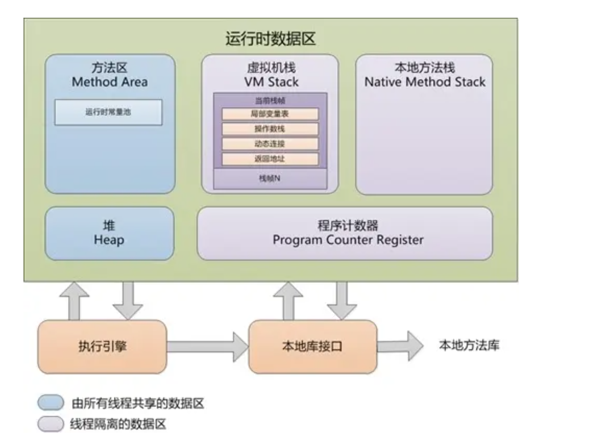

1. 内存结构
  * 分布图
  
  * 方法区：类的所有信息都存在方法区，堆中分配一个class对象，指向方法区
  * 堆：堆大小可以用-Xmx -Xms控制
  * 对象分配：具体如何申请空间，需要根据垃圾收集算法来确定。一般来说，带有空间压缩的垃圾收集使用**指针碰撞**，即移动指针来分配一块连续空间。而对于标记清除的垃圾收集，则只能采用**空闲列表**的方式分配。**对象分配用CAS确保线程安全**
  * 对象内存布局：对象头、实例数据、对齐填充
    1. 对象头分为三部分：
      * Mark word(32bit系统中): 包括hashCode(25bit)，分代年龄(4bit)、锁标志(2bit)、0(1bit)
      * 类型指针，指向
    2. 实例数据: 父类属性、子类属性
    3. 对齐填充部分，按8字节对齐
  * 栈溢出：hotspot不支持动态栈大小，所以每个线程能分配的栈大小是一定的，用-Xss指定。
    1. 如果栈帧过多，大多数情况是因为循环调用，会导致stackOverFlow
    2. 如果栈帧多大，如果某个方法分配了过多局部变量，导致栈容量不够，会导致stackOverFlow
  * 内存溢出：
    * **如果线程数量过多，因为每个线程能分配的栈容量固定，所以越多线程将会分配越多空间，就会导致发生OutOfMemory**
2. 垃圾收集
  * 判定存活对象
    1. 引用计数：循环引用问题
    2. 可达性判断：基于GC Roots的图搜索，判断可达性。
      * GC Roots: 虚拟机栈的局部变量表、静态变量、常量引用、Native栈中的引用、虚拟机内部引用(如基本类型的class对象和常驻异常对象)、synchronized锁住的对象...
    * 引用类型：引用是一种类型，实际就是指针，和c，c++别无二致，引用存储的是对象地址。但是，Java扩展了引用，加入了强、软、弱、虚四种概念。软引用在下次回收时，就可以回收，弱引用在下次就一定会回收。
    * 第二次机会：第一次被标记为不可达时，会对jvm会调用那些覆盖了finalize()方法且没有调用过finalize的对象的finalize，稍后会才会继续回收，所以对象可以在第一次被回收时通过finalize()逃脱。finalize方法完全可以忘却，因为没有什么用
  * 分代收集理论假设：
    * 大多数对象朝生夕灭
    * 存活越久的对象越不容易被回收
    * 跨代引用很少：将老年代划分成小块，将存在跨代引用的块加入remembered set
  * 标记-清除：标记存活对象，回收未存活对象，会有大量碎片，对象多时效率低、碎片太多而不足以分配一片连续空间时，会再次触发回收
  * **标记复制**：使用两块相同大小空间，标记存活对象，从A移动到B，然后清空A。简单高效，但浪费空间。新生代使用该种算法，因为存活对象少，并且针对**大多数对象朝生夕灭**的假设，将新生代分为eden区和两块小的survivor区，垃圾收集时，将Eden区和A区存活对象复制到B区。而如果10%的B区无法放下所有对象，就需要**老年代做分配担保**
  * 标记整理算法：标记存活对象，移动到另一端，避免内存碎片，但存活对象多时，移动开销很大
  * **老年代回收**：老年代一般可以采用**标记-清除+标记-整理**，因为老年代回收收益不大，根据假设会有大量存活对象，所以**一般采用标记-清除，但是当碎片变多后，使用标记-整理**
  * **Stop The Word**
    * 枚举根节点：必须Stop The Word，即使是ZGC
  * **安全点和安全区域**
    * oopMap用于记录指针，以快速找到可达对象，而不用根据图枚举。而由于oopMap变化多，所以无法对每一条指令都生成一个oopMap，所以需要安全点。
    * 用户线程执行到安全点时，会执行一条插入的汇编指令，读某个地址。如果垃圾收集开始，则收集器将这个地址设置为不可读，用户线程此时会发生中断，如果都发生了中断，就可以开始枚举根节点了。
    * 对于挂起的线程，使用安全区域，执行到安全区域的用户线程会标识自己已进入安全区域
  * remembered set
    * 记忆集用来存储所有非收集区域到收集区域的指针
    * 记忆集中指针指向的块，代表有跨代指针，将该块加入GC Roots
    * 记忆集在新建对象时通过AOP维护
  * 三色标记：即未访问过、访问中(还有引用没有访问完)、已访问过
    * 对象消失：三色标记过程和用户线程并发，如果用户线程切断了访问中对象的未访问对象的引用，并且插入到已访问对象上，就会导致对象消失，即存活对象被标记为可回收，需要通过增量更新或者原始快照打破两个条件。就是扫描完后，再次扫描有新增引用的黑色对象或者那些被切断的引用
    * 上述自然引出CMS收集器：初始标记(STW，枚举出GC Roots直接关联对象)、并发标记(三色标记过程)、重新标记(STW，增量更新或者原始快照以修正)、并发清除
  * Garbase First: G1
    * 分region收集，跟踪region，回收那些价值高的region。
    * minor gc会Stop The World，且不可配置，一般在Eden区用完就会开启。
    * 讨论垃圾收集时，一般讨论包含老年代的收集，因为新生代收集很快
  * ZGC
    * 通过四个bit做染色标记
    * 同样需要初始标记、并发标记、重新标记三个阶段
    * 因为用bit来标记存活状态，并且没有记忆集，所以标记过程很快
    * 将region加入集合，对于集合中的region，每个对象的指针被用于了标记。
    * 现在假设一个regionC要被回收，regionA，regionB中分别有对象指向regionC中的对象，那么regionA和regionB中的这些指针应该要放到一个映射表中，当用户线程通过regionA或者regionB访问regionC中对象时，重定向到映射表。而regionA和regionB中指针的mapped字段被标记为1，当所有region的这些指针都被加入到映射表之后，regionC就可以直接清空了。
      