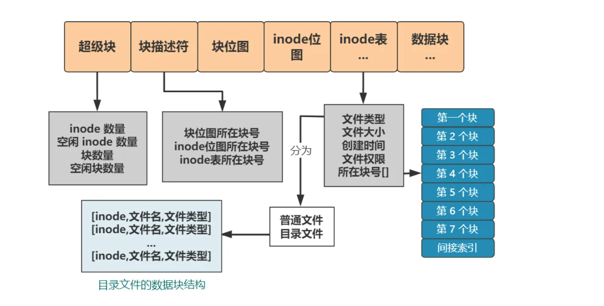

#### 操作系统
1. 进程和线程：以数据结构(**PCB**)来区分二者
  * 进程：执行中的程序，包含**文本段(程序代码)**、**数据段(全局变量)**、**堆**、**IO状态**、**子进程**、**PC、寄存器、栈、当前状态(state)**、**地址空间(页表)、记账信息(cpu时间等)**
  * 线程：一段逻辑流，**包括PC、寄存器、栈、当前状态(state)**
  * linux实际上以进程为调度单位、主线程就是进程，当创建线程时，只是创建了一个子进程，而这个子进程调用pthrad而不是fork创建，几乎**浅拷贝**了所有的PCB信息，浅拷贝一词恰好可以表达出线程共享进程空间的特性。随后，线程的执行类似于调用exec，只是exec会新建一个页表指针，从而完全释放和父进程的共享资源。而线程则不需要这一步，直接在页表上创建一个栈，更新sp和pc即可
2. IPC(进程间通信)
  * 不论是共享内存还是管道，都利用了文件是进程的共享资源的特点。
  * **共享内存**：通过相同的name，得到一个文件描述符，这个文件描述符对应**操作系统的一块内存缓冲区**，没有实体磁盘文件，进程需要通过mmap将自己的部分页表条目挂载到这块物理内存，从而实现共享。
  * **管道**：管道和共享内存的思路相同，只不过管道文件是有拷贝的，即有**用户缓冲区和内核缓冲区**，所以通信时存在内存拷贝，但是管道的使用相比于共享内存要简单，因为只要在父进程创建，再创建子进程，自然就可以共享这个**管道文件**了
  * **RPC**
3. 进程、线程调度：调度分为长期调度和短期调度
  * 长期调度指的是将提交任务放到就绪队列、短期调度是cpu从就绪队列调度进程到cpu运行
  * **FCFS(First-Come First-Served)**：先到先服务，非抢占调度，如果一个CPU密集型的长任务和多个IO密集型短任务，一旦cpu长任务拿到cpu，就会导致平均等待时间非常长
  * **最短作业优先**：最短作业优先是最优调度方法，平均时间最短。适合用于长期作业调度，任务提交时可以有意精确估算任务耗时。如果允许抢占，那就是**最短剩余时间优先**，因为当新任务被提交时，需要计算当前执行任务剩余耗时和新任务的耗时
  * **优先级调度**：最短作业优先是一种优先级调度。
  * **RR(Round-Robin)，轮转调度：专为分时系统设计**，按照时间片调度，期望通过时间片的合理设计，使得大多数任务都能在一个时间片内完成，这样调度时间会更接近最短作业优先，而如果时间片过大，会退化成FCFS。时间片太小，又会导致上下文切换开销太大。
  * 多级队列和多级反馈队列调度
4. 死锁：互斥、持有并等待、循环等待、非抢占
5. 物理内存管理
  * 分页：避免了碎片管理。
  * 为了避免页表占用空间过大，使用多级页表，对于64位系统，采用hash页表
6. 虚拟内存管理：这里的虚拟内存，讨论利用虚拟地址的功能，实现虚拟地址无限大，远大于物理地址的效果。而不关注页表设计
  * 请求调页：只有需要时才加载页面
  * 缺页错误：请求调页会产生缺页错误，此时需要检查进程pcb，判断为有效访问后，分配物理帧，并调度磁盘，然后重新启动被中断的指令。copy on write和lazy alloc也会产生类似的page fault。中心思想都是需要时才分配
  * 页面置换：页面置换是能进行demanding page、copy on write、lazy alloc的核心，当物理内存不够时，换出部分页
  * 页面置换算法：
  * FIFO: 先入先出
  * LRU: **LRU用来近似最优置换算法，因为最优置换需要未来的知识，不可实现**。LRU使用hash+双向链表实现
  * 额外引用位：**即使LRU也难以实现**，可以通过用多个bit来标记一个页，每个时钟周期内，如果被引用，就右移一位，填充最高位为1。8bit组成的数越大，越是最近使用的，且最频繁
  * LFU: 最小频率使用的，采用引用计数，换出计数量最小的。
5. [文件系统](https://mp.weixin.qq.com/s/j2msue1Hjcwd9z1U2p0TDQ?poc_token=HCLNCmajN60dsoawxZHBrhcXbj0bMuVkrYNdU-5u)
  * 图示：
  
  * 分块：一般以1KB为1个块，即两个扇区，根据块编号寻找磁盘扇区就交给IO驱动了。
  * 超级块：记录块数量、空闲块数量、inode数量、inode空闲数量，可以快速知道文件系统的剩余容量。
  * 块描述符：描述了文件系统块位图、inode位图、inode表的起始块位置。如果写死这三者，则不好扩展，文件系统受限。于是加上这三个指针信息，则可以轻松扩展。
  * 块位图：记录每个块的使用情况
  * innode位图，记录每个innode的使用情况
  * innode表，存储每一个innode结构，假设时128 byte，则一个块可以存储8个innode。
  * 随后是数据块。
  * innode: innode表示一个文件，主要包含类型、大小、创建时间、权限、文件内容所在块的索引。有直接索引和间接索引。
  * 目录文件数据块：如果只有内容文件，此时已经万事大吉了，但是要加入层级、也就是目录的概念，所以多了目录文件的概念。目录文件的数据块，每一块都记录了一个innode指针，指向文件的innode。同时，为了检索方便，我们把文件名放入目录数据块，那么name就不需要在innode存储了，同时将文件类型冗余存储在目录数据块，我们叫entry
  * 此时，我们再规定，第0个innode表示根目录，这样一个文件系统就完成了。
  * 挂载：有了上面的概念，挂载一个文件系统就相当简单了。操作系统一定要先读一个文件系统。此时，当我们要挂载新设备时，从磁盘的某个地方加载文件系统，挂载到某个目录下，自然就可以轻松使用了。
  * 当从一个磁盘加载一个文件系统时，只需要加载必要的信息，甚至块位图都不需要加载进入内存，当然，我们期望加载以获得高性能
  * 操作系统会使用虚拟文件系统，屏蔽不同文件系统的区别
  * 操作系统会维护一张打开文件表，每个进程调用open打开文件时，会得到一个文件描述符，所以我们说文件是进程的共享资源，因为打开文件表是全局共享的
  * 对于文件的写操作，采用经典的write log first, then write data策略，保证一致性
6. [设备控制器](https://mp.weixin.qq.com/s/fKHOf_CzG8HYXHlg54V_rg)
  * 设备控制器与cpu交互图示：
  